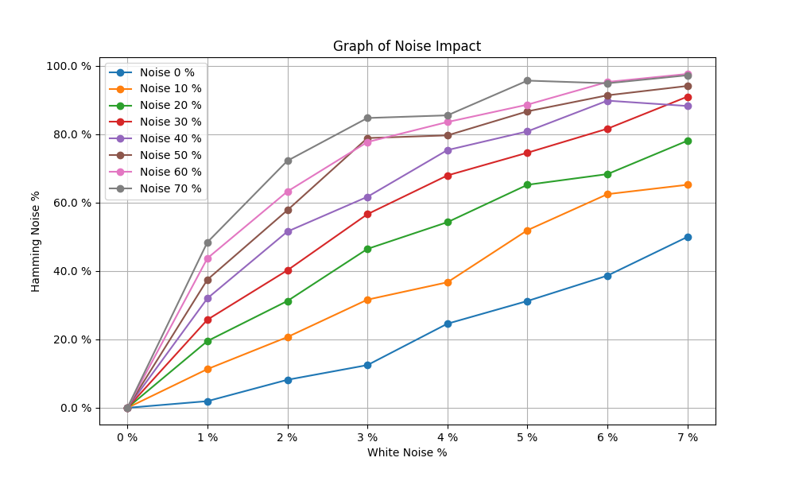

<pre>
UNIVERSIDAD DEL VALLE DE GUATEMALA

Facultad de Ingeniería

CC3085 – Redes

Sección 10

Ing. Miguel Novella Linare

Laboratorio 2

Samuel Argueta - 211024

Alejandro Martinez - 21430

GUATEMALA, 25 de julio de 2024
</pre>

# DESCRIPCIÓN DE LA PRÁCTICA
En este caso, el propósito del laboratorio es familiarizarse con el concepto de capas de una manera práctica enviando mensajes de manera local entre un “emisor” y un “receptor” emulado de manera local, en donde, los mensajes deberán ser traducidos a binario y, en algunos casos, poseer errores, justo como sucedería en un escenario real. Se debe solicitar un mensaje de entrada, que es lo que el Emisor desea transmitir, el cual deberá ser traducido a binario. El Receptor recibirá este código binario y deberá validar que esté bien, en caso de estarlo, mostrará el mensaje, en caso contrario, mostrará mensaje de error.

# METODOLOGÍA
Utilización del concepto de Sockets para la comunicación entre clientes, esto con el fin de poder enviar y recibir mensajes de manera simulada entre emisor y receptor. En donde cada uno tendrá su implementación en lenguajes diferentes, con el fin de poder ser más realista la simulación. En este caso se tiene registro de cada uno de los envíos que se realizan del emisor a receptor mediante un archivo .log para constatar cada uno de los resultados.

# RESULTADOS
| [Stats](./Stats.html) | [Log](./Log.html) |
|--|--|

### Ejemplos de un fallo y una corrección:
<pre>
[Send] Message : Indica el mensaje original.
[Send] Hamming : Mensaje, en bits, despues del algoritmo de Hamming.
[Send] Noisy :  Mensaje, en bits, despues del algoritmo de Hammingr Ruido.
	<y>En amarillo</y> [ERROR RATE]: Bits con Ruido Blanco
	<g>En verde   </g> [NOISE FACTOR]: Bits restringidos a un solo flip cada 7 bits (cada chunk de hamming)
<y>[Hamming]</y> Errors  : Indica la posición de los bits con errores.
<g>[Hamming]</g> Decoded : Mensaje en bits despues de ser decodificado.
<g>[CRC32]</g> o <r>[CRC32]</r> y los hashes si el mensaje se computa correctamente.
<g>[Received]</g> : Mensaje original si se recibió correctamente.
</pre>
<pre>
[Send] Message: est fugiat eiusmod
[Send] Hamming: 110011001001010001111100001100011111001100010101000000001100110110011000011110100101110011000011111100110001100111001101101001000111110011000101010000000011001100100101110011000110010001111010010100011111000011110011010101011100110111111111001101001100
[Send] Noisy  : 1100110010010100011111000011000111110011000101010000000011001101100<g>0</g>10000111101001<g>1</g>111<y>0</y>0110000111111001100011001110011<g>1</g>11<g>1</g>1001000111110011000101010000000011001100<g>0</g>00101110011000110010<y>1</y>0111101001010<y>1</y>011111000011110011010101011100110111<g>0</g>11111<g>1</g>01101001100
<y>[Hamming]</y> Errors: 1100110010010100011111000011000111110011000101010000000011001101100<r>0</r>10000111101001<r>1</r>11100110000111111001100011001110011<r>1</r>11<r>1</r>1001000111110011000101010000000011001100<r>0</r>00101110011000110010<r>1</r>0111101001010<r>1</r>011111000011110011010101011100110111<r>0</r>11111<r>1</r>01101001100
[Hamming] Decoded: 011001010111001101110100001000000110011001110101011001110110100101100001011101000010000001100101011010010111010101110011011011010110111101100100
<g>[CRC32]</g> Verified 0x47a97694 == 0x47a97694
<g>[Success]</g> : est fugiat eiusmod
</pre>
<pre>
[Send] Message: aliqua. laborum.
[Send] Hamming: 11001101101001110011001111001100110001100100011111101001000111101001011100110110100101010100010110010101000000001100110011110011001101101001110011001010101100110111111100011110101010000111101001011100110101010101010100010110
[Send] Noisy  : 1100110110100111<g>1</g>0110<y>1</y>11110011001100011001000111111<g>1</g>1001000111101001011<g>0</g>001101101001010101000<g>0</g>0110010101000000001100110011110011001101101001110011001010101100110111<g>0</g>111000111101010100<y>1</y>01<g>0</g>1101001011100110101010101010100010110
<y>[Hamming]</y> Errors: 1100110110100111<r>1</r>0110<r>1</r>11110011001100011001000111111<r>1</r>1001000111101001011<r>0</r>001101101001010101000<r>0</r>0110010101000000001100110011110011001101101001110011001010101100110111<r>0</r>11100011110101010010101<r>1</r>01001011100110101010101010100010110
[Hamming] Decoded: 01100001011011000110100101110001011101010110000100101110001000000110110001100001011000100110111101110010001001010110110100101110
<r>[CRC32]</r> Failed 0x5b16ee51 != 0x5fbf871b
<r>[Failure]</r>
</pre>
# DISCUSIÓN
CRC32 es altamente fiable para la detección de errores en los datos transmitidos, pero carece en la corrección de los mismos. Este no corrige los errores, pero es extremadamente eficaz para detectarlos. Su poder está en que puede detectar rafagas de errores, esto se entiende por varios bits incorrectos en la transmisión pero, si la tasa de errores es alta, lo detecta, solo que se debe realizar una retransmisión de datos o el uso de un algoritmo adicional.

En contraparte, Hamming no solo detecta errores, sino que también los corrige. Este es mas flexible para manejar y corregir errores de 1 solo bit, pero su capacidad de corrección disminuye drásticamente cuando aumenta la tasa de errores. No puede corregir errores en rafaga, es decir, múltiples bits con problemas en la transmisión.

Cada uno tiene su escenario de uso. Hamming es útil en situaciones donde la corrección de errores es crucial; CRC32 es eficiente y rápido en la detección de errores, lo que lo hace adecuado para entornos donde la corrección de errores no es crítica, pero la detección rápida es esencial.

| Algoritmos de detección de errores (CRC32) | Algoritmos de Corrección de errores (Hamming Code)|
|--|--|
| Alta tasa de errores, esto es cuando la probabilidad de errores es alta y la corrección en el lugar no es factible o eficiente. | Baja tasa de errores, donde los errores son raros y se pueden manejar de manera eficiente en el lugar. |
| Retransmisión de datos, donde es viable transmitir datos, como en redes de computadoras, se puede utilizar para detectar errores y solicitar una retransmisión si se detecta un error. | Crítica de corrección en tiempo real, aplicaciones críticas donde la corrección en tiempo real es esencial, como en sistemas de memoria de computadoras y comunicaciones espaciales. |
| Simplicidad y eficiencia, cuando se necesita un método simple y eficiente para verificar la integridad de los datos sin la sobrecarga de la corrección de errores. | Limitación de retransmisión, Cuando la retransmisión de datos no es posible o deseable debido a restricciones de tiempo o ancho de banda. |

# CONCLUSIONES
Cada algoritmo es útil según las necesidades. CRC32 es más adecuado para la detección rápida y eficiente de errores en sistemas donde la retransmisión es una opción. Hamming Code es ideal para entornos donde la corrección de errores en tiempo real es crucial y la tasa de errores es baja.

El Algoritmo de Hamming nos permite corregir errores, dado que solo exista un error en el chunk/segmento definido. Adicionalmente de este ruido controlado, al usar ruido blaco se pueden introducir errores que no se pueden corregir.

Dado este hecho, se utiliza el Algoritmo / hashing CRC32 para verificar si existen errores que hamming no pudo corregir, lo cual descarta ese mensaje.

# REFERENCIAS
Ritter, C. (2016, March 6). A painless guide to CRC error detection algorithms. Command Line Fanatic. https://commandlinefanatic.com/cgi-bin/showarticle.cgi?article=art008

GeeksforGeeks. (n.d.). Modulo-2 binary division. Retrieved August 1, 2024, from https://www.geeksforgeeks.org/modulo-2-binary-division/

GeeksforGeeks. (n.d.). Hamming code in computer network. Retrieved August 1, 2024, from https://www.geeksforgeeks.org/hamming-code-in-computer-network/

TechTarget. (n.d.). Hamming code. Retrieved August 1, 2024, from https://www.techtarget.com/whatis/definition/Hamming-code